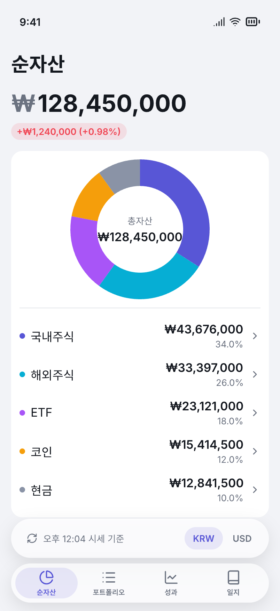
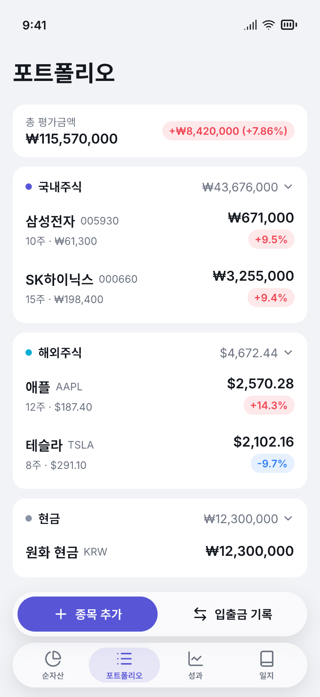
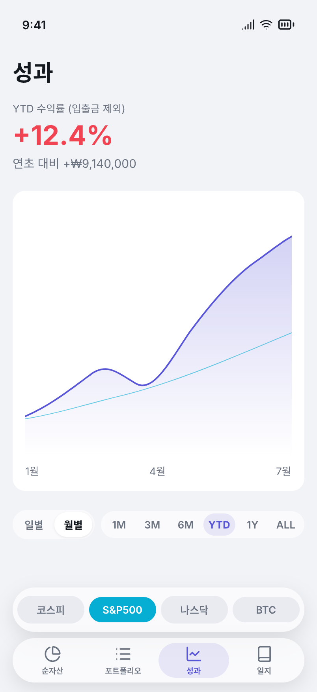
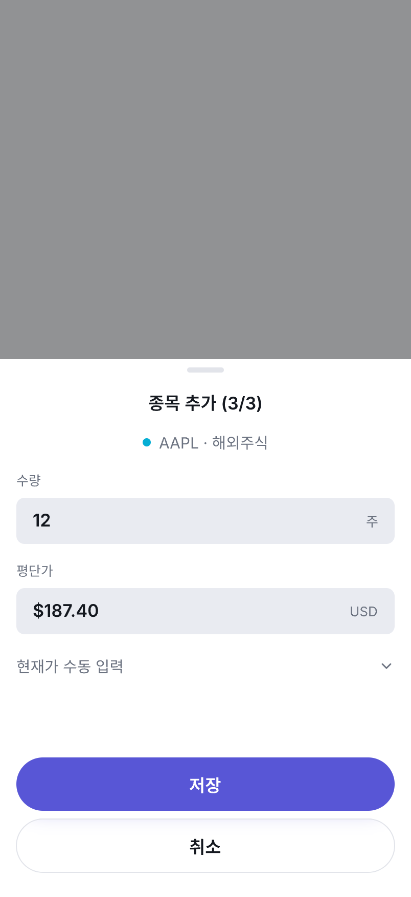
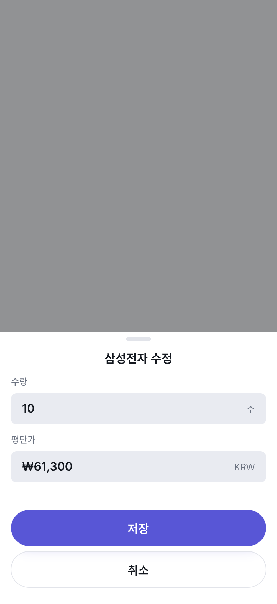
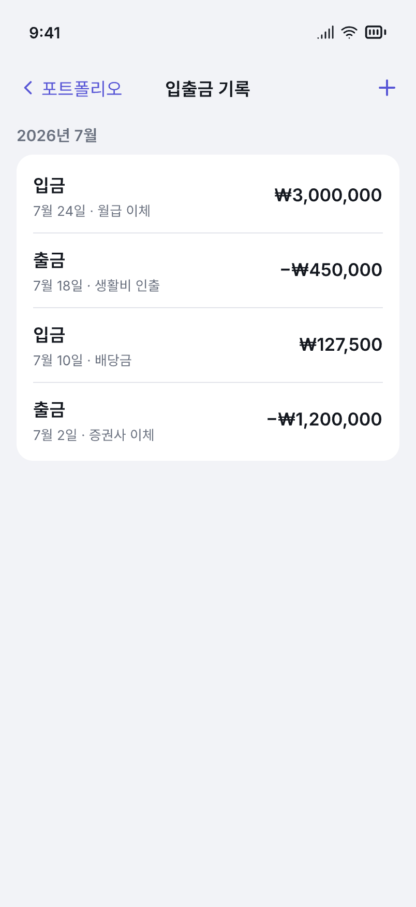
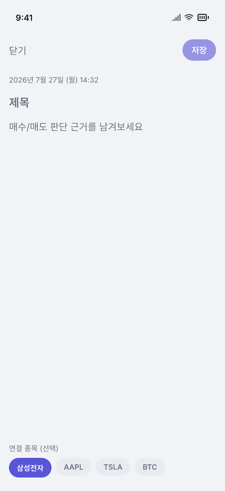
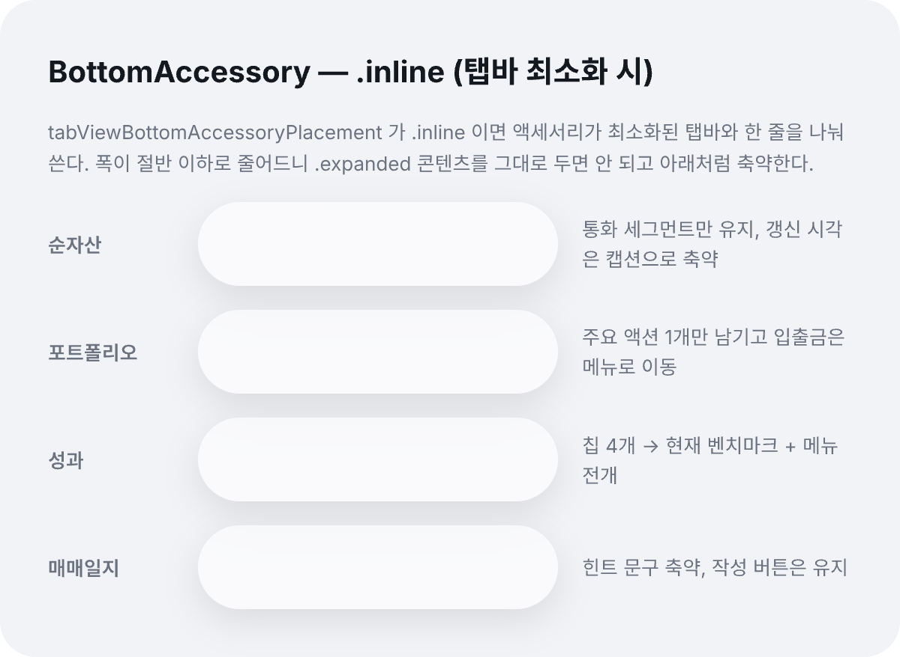

# Hannun Pencil 시안 레퍼런스

- 작성일: 2026-07-31
- 대상 원본: `hannun.pen` (저장소 루트, 2026-07-27 제작)
- 상태: 시안 확정 — SwiftUI 구현 시 이 문서와 원본을 함께 본다
- 관계 문서
  - 규격의 근거: `docs/design/2026-07-27-ui-design-spec.md` (원칙·토큰·Glass 규칙의 **원본**)
  - 기능 정의: `docs/design/2026-07-21-personal-asset-management-ios-app-design.md` (NW-/PF-/PM-/JR-)
  - 구현 규약: `docs/claude/design-system.md`

> **이 문서의 역할**: UI 스펙이 "무엇을 왜 그렇게 그리는가"를 정하고, `hannun.pen` 이 그것을
> 실제 픽셀로 그린 결과다. 이 문서는 그 사이를 잇는다 — 시안의 노드 구조·실측값을 코드에서
> 바로 쓸 수 있는 형태로 옮기고, **시안대로 만들면 안 되는 지점**을 명시한다.

## 1. 원본 파일 다루기

`.pen` 은 암호화 포맷이다. **`Read`/`Grep`/`cat` 으로 열 수 없고 열어서도 안 된다.**
반드시 Pencil MCP 도구(`mcp__pencil__*`)를 쓴다.

```
1. Pen.app 을 먼저 띄운다     open -a "Pen" hannun.pen
2. get_editor_state(include_schema: true)   ← 스키마 없이는 다른 도구를 못 쓴다
3. get_variables / batch_get / get_screenshot / export_nodes
```

> MCP 는 **실행 중인 Pen.app 에 붙는 방식**이다. 앱이 꺼져 있으면
> `failed to connect to running Pencil app: desktop` 이 나온다 — 파일 경로 문제가 아니다.

캔버스 좌표계(노드 ID 는 `batch_get` 의 `nodeIds` 에 그대로 넣으면 된다):

| 영역 | 위치 | 내용 |
|------|------|------|
| 컴포넌트 | y ≈ −1050 ~ −840 | 재사용 컴포넌트 8종 (§4) |
| 화면 1행 | y = 0 | 탭 4종 — x = 1000 / 1560 / 2120 / 2680 |
| 화면 2행~ | y = 1000 / 2000 / 3000 | 시트·서브 화면 |
| 스터디 | x = 3240, y = 0 | 액세서리 `.inline` 대응 (§7) |

## 2. 화면 지도

캔버스 프레임은 전부 **402 × 874** — iPhone 16 Pro 논리 해상도다.
`clip: true` 라 콘텐츠가 넘치면 잘린다(스크롤 없음). 시안은 항상 "한 화면에 들어가는 양"만 그린다.

| 노드 ID | 화면 | 기능 ID | 캡처 |
|---------|------|---------|------|
| `T8ZpBh` | 순자산 탭 | NW-1~4 | `assets/pencil/01-networth-tab.png` |
| `gnKPk` | 포트폴리오 탭 | PF-1 | `assets/pencil/02-portfolio-tab.png` |
| `XUilQ` | 성과 탭 | PM-2~4 | `assets/pencil/03-performance-tab.png` |
| `TDKY2` | 매매일지 탭 | JR-1, JR-4 | `assets/pencil/04-journal-tab.png` |
| `reioU` | 종목 추가 sheet | PF-2 | `assets/pencil/05-add-holding-sheet.png` |
| `Z37sm` | 종목 수정 sheet | PF-3 | `assets/pencil/06-edit-holding-sheet.png` |
| `Kympp` | 입출금 기록 | PF-5, PF-6 | `assets/pencil/07-cashflow-list.png` |
| `pbEqw` | 일지 작성 | JR-2 | `assets/pencil/08-journal-compose.png` |
| `gMyiS` | 액세서리 `.inline` 대응 | — | `assets/pencil/09-accessory-inline.png` |

캡처는 2x PNG 로 내보낸 것이라 원본이 아니다. 실측이 필요하면 `batch_get` 으로 노드를 직접 읽는다.

모든 탭의 공통 세로 스택:

```
StatusBar(62)  →  NavBarLargeTitle  →  Content(fill)  →  BottomAccessory  →  TabBar
```

## 3. 디자인 토큰 — .pen 변수 ↔ 코드

`.pen` 변수와 UI 스펙 §2 표는 **값이 완전히 일치**한다(검증 완료). 코드 토큰명은 스펙 §2 를 따른다.
`.pen` 은 `mode: light | dark` 테마 축을 갖고 있어 두 값이 모두 들어 있다.

### 3.1 컬러

| `.pen` 변수 | 코드 토큰 | 라이트 | 다크 |
|-------------|-----------|--------|------|
| `bg` | `backgroundPrimary` | `#F2F3F7` | `#14161F` |
| `surface` | `surfacePrimary` | `#FFFFFF` | `#1D2029` |
| `surface-secondary` | `surfaceSecondary` | `#E9EBF1` | `#272B36` |
| `text-primary` | `textPrimary` | `#14181F` | `#F2F4F8` |
| `text-secondary` | `textSecondary` | `#6B7280` | `#9AA1AE` |
| `brand` | `brand` | `#5856D6` | `#6E6CFF` |
| `separator` | `separator` | `#E2E4EA` | `#2E3340` |
| `gain` | `gain` | `#F04452` | `#FF6E6E` |
| `loss` | `loss` | `#3182F6` | `#64A8FF` |
| `neutral` | `neutral` | `#6B7280` | `#9AA1AE` |
| `category-cash` | `categoryCash` | `#8A93A6` | `#98A2B8` |
| `category-domestic` | `categoryDomestic` | `#5856D6` | `#7C7AFF` |
| `category-foreign` | `categoryForeign` | `#06AED4` | `#22C6E6` |
| `category-etf` | `categoryEtf` | `#A855F7` | `#C084FC` |
| `category-crypto` | `categoryCrypto` | `#F59E0B` | `#FBBF24` |

**tint 변수** (`brand-tint`/`gain-tint`/`loss-tint`/`neutral-tint`)는 원색에 알파를 얹은 값이다 —
라이트 `1F`(12%), 다크 `2E`(18%). 코드에서는 하드코딩하지 말고 `원색.opacity(0.12 / 0.18)` 로 파생시킨다.

**상승 = 빨강 / 하락 = 파랑** (국내 관례). `gain` 이 빨강인 것이 오타가 아니다.

### 3.2 타이포·스페이싱·반경

| `.pen` 변수 | 값 | 코드 토큰 |
|-------------|-----|-----------|
| `font-display` | 34 | `displayAmount` (Bold) |
| `font-title` | 28 | `screenTitle` (Bold) |
| `font-section` | 20 | `sectionHeading` (Semibold) |
| `font-row` | 17 | `rowTitle` / `rowAmount` / `body` |
| `font-sub` | 15 | `subtext` |
| `font-caption` | 13 | `caption` / `pillLabel` |
| `spacing-xs` ~ `spacing-xxl` | 4 / 8 / 12 / 16 / 24 / 32 | `spacingXS` ~ `spacingXXL` |
| `radius-s` / `radius-m` / `radius-l` | 8 / 16 / 24 | `radiusS` / `radiusM` / `radiusL` |

탭바 라벨만 토큰 밖의 **10pt Semibold** 를 쓴다(시스템 탭바 관례).

## 4. 재사용 컴포넌트 8종

시안에서 `reusable: true` 로 정의돼 인스턴스로 재사용되는 것들이다.
UI 스펙 §5 인벤토리(18종)의 **부분집합**이다 — 시안에 없는 나머지는 §8 참고.

| 노드 ID | 컴포넌트 | 실측 | 대응 |
|---------|----------|------|------|
| `uBXoB` | `ChangePill` | capsule, padding `[4, 8]`, tint 배경, 라벨 13 Semibold | `ChangePill` |
| `sVklS` | `glass/FilterChip` | capsule, padding `[8, 14]`, 라벨 13 Semibold | `FilterChip` |
| `XFnrJ` | `SectionHeader` | dot 8 + 이름 15 Semibold ｜ 소계 15 + `chevron-down` 16 | `CategorySectionHeader` |
| `fq0Sb` | `StatusBar` | 402×62 | **구현 불필요** (목업 전용) |
| `pFiEH` | `NavBarLargeTitle` | 타이틀 28 Bold, padding `[8, 16]` | `.navigationTitle` + `.large` |
| `BgjId` | `TabBar` | 캡슐 56, radius 28, padding 6, 탭 4개 | 시스템 `TabView` |
| `GxcXV` | `HoldingRow` | padding `[12, 16]`, 2단 | `HoldingRow` |
| `Xd0Lw` | `BottomAccessory` | 캡슐 56, radius 28, `slot` 프레임 보유 | `.tabViewBottomAccessory` |

`HoldingRow` 내부 구조 (PF-1):

```
좌: [종목명 17 Semibold · 티커 13 secondary]  gap 6
    [서브라인 13 secondary]  "10주 · ₩61,300"   ← 수량 · 평단가
우: [평가금액 17 Semibold]                       ← alignItems: end
    [ChangePill]                                 ← 현금 행에서는 서브라인·pill 숨김
```

## 5. 시안 표현 ≠ 구현 (중요)

Pencil 은 정적 캔버스라 iOS 26 의 실제 렌더링을 그대로 표현하지 못한다.
**아래 항목은 시안을 그대로 옮기면 오히려 틀린다.**

| 시안 | 구현 | 이유 |
|------|------|------|
| `font: "Inter"` | **시스템 폰트(SF Pro)** | Pencil 에 SF Pro 가 없어 대체한 것. 스펙 §2.2 는 SF Pro 확정 |
| `$glass` = `#FFFFFF99` / `#1D202999` | `.glassEffect(.regular)` | 반투명 흰색은 Liquid Glass 의 **모사**다. 실제 재질을 하드코딩 색으로 대체하지 않는다 |
| `background_blur(20)` + `shadow` | `.glassEffect` 가 내장 | 캡슐에 blur/shadow 를 직접 얹지 않는다 |
| 도넛 = `ellipse` 5개 겹침 | Swift Charts `SectorMark` | §6.1 의 각도값은 비율 검증용이지 좌표가 아니다 |
| 추이 차트 = `path` geometry | Swift Charts `LineMark` + `AreaMark` | 시안 path 는 예시 곡선. 실데이터로 그린다 |
| 선택 칩·주요 액션의 **흰 라벨** | `Color.onBrand` | 라이트는 시안대로 흰색. 다크는 `brand` 가 밝아져(`#6E6CFF`) 흰 라벨 대비가 4.0:1 로 AA 미달이라 잉크로 뒤집는다 (UI 스펙 §2.1) |
| `StatusBar` 프레임 | 그리지 않는다 | 시스템이 그린다 |
| lucide 아이콘 | SF Symbols (§5.1) | |
| 숫자 예시값 | 전부 목업 | `#if DEBUG` 프리뷰 데이터로만 사용 |

### 5.1 아이콘 매핑 (lucide → SF Symbols)

| 시안 | SF Symbols | 쓰임 |
|------|-----------|------|
| `chart-pie` | `chart.pie.fill` | 순자산 탭 |
| `list` | `list.bullet` | 포트폴리오 탭 |
| `chart-line` | `chart.line.uptrend.xyaxis` | 성과 탭 |
| `book` | `book.closed` | 일지 탭 |
| `plus` | `plus` | 종목 추가 |
| `arrow-left-right` | `arrow.left.arrow.right` | 입출금 |
| `chevron-down` | `chevron.down` | 섹션 접기, 확장 |
| `search` | `magnifyingglass` | 일지 검색 |
| `refresh-cw` | `arrow.clockwise` | 시세 갱신 시각 |

## 6. 화면별 실측 구조

### 6.1 순자산 탭 `T8ZpBh` (NW-1~4)



Content padding `[8, 16, 0, 16]`, gap 16.

- **TotalAssetBlock** `NNE3O` — 통화기호 `₩` 34 Bold **secondary** + 금액 34 Bold primary (gap 2,
  `alignItems: end`). 아래 `ChangePill` 에 일간 변동 `+₩1,240,000 (+0.98%)`.
  통화기호를 한 단계 죽이는 것이 스펙 §2.2 의 "금액 표기 위계"다.
- **AllocationCard** `P0pS8z` — surface, radius 16, padding 12.
  - 도넛 200×200, `innerRadius 0.62`, **12시(90°)에서 시계방향**.
    섹터 순서·비율: 국내주식 34% / 해외주식 26% / ETF 18% / 코인 12% / 현금 10%.
  - 중앙 홀: "총자산" 13 secondary + 금액 17 Semibold.
  - 구분선(`separator` 1pt) 아래 카테고리 5행. 각 행 = dot 8 + 이름 ｜ 금액 + 비중% + chevron.
    **NW-4 진입점** — 행 탭 시 포트폴리오 탭으로 이동하며 해당 카테고리 필터 적용.
  - 도넛 섹터 색과 행 dot 색은 **같은 토큰**이어야 한다. 리스트가 곧 범례다.
- **액세서리** `bjQi7` — 좌: `arrow.clockwise` + "오후 12:04 시세 기준" 13 secondary /
  우: KRW·USD 세그먼트(선택 = `brand-tint` 배경 + `brand` 라벨). **NW-2**.

### 6.2 포트폴리오 탭 `gnKPk` (PF-1)



Content padding `[12, 16, 0, 16]`, gap 12.

- **SummaryBar** `so1Mh` — "총 평가금액" 13 secondary + 금액 17 Semibold ｜ `ChangePill`(금액+%).
- **카테고리 섹션** — 카테고리마다 surface 카드 하나(radius 16, padding `[8, 0]`).
  - 헤더는 `SectionHeader` 인스턴스를 padding `[0, 16]` 래퍼에 넣는다.
  - 그 아래 `HoldingRow` 인스턴스를 나열. 행 좌우 패딩은 행이 갖고 카드는 갖지 않는다
    (구분선을 좌우 여백에서 끊기 위한 구조).
  - 시안에는 국내주식·해외주식·현금 3개만 그려져 있다. ETF·코인도 같은 패턴이다.
- **액세서리** `kyiZ5` — `AddHoldingButton`(brand 채움 capsule, 흰 라벨) +
  `CashFlowButton`(투명). 툴바 액션은 전부 여기로 이관됐다 — NavBar 의 액션 영역은 `enabled: false`.

### 6.3 성과 탭 `XUilQ` (PM-2~4)



Content padding `[8, 16, 0, 16]`, gap 24.

- **YTDBlock** `GJPTL` — "YTD 수익률 (입출금 제외)" 13 secondary / 값 34 Bold **`$gain`** /
  "연초 대비 +₩9,140,000" 15 secondary. 캡션에 입출금 제외를 명시하는 게 **PM-3** 의 정의다.
- **TrendChartCard** `XQeWz` — surface, radius 16, padding 16.
  - 플롯 338×320, `clip: true`.
  - 내 수익률 라인: `brand`, 2pt, round cap. 그 아래 area gradient `#5856D64D → #5856D600`(위→아래).
  - 벤치마크 라인: `category-foreign`, 1pt, opacity 0.6 — **주선보다 확실히 약하게**.
  - 축 라벨 3개(1월/4월/7월)를 `space_between` 으로 배치.
- **ControlsRow** `cdibb` — 좌: 일별/월별 토글(선택 = `surface` 채움 + 미세 그림자) /
  우: 기간 세그먼트 `1M 3M 6M YTD 1Y ALL`(선택 = `brand-tint` + `brand` 700).
  **차트 바로 아래 인라인** 이다. 액세서리가 아니다(스펙 §2.4).
- **액세서리** `EikF0` — 벤치마크 칩 4개(코스피 / S&P500 / 나스닥 / BTC). **PM-4**.
  - 선택된 칩은 `brand` 가 아니라 **해당 벤치마크의 카테고리 색**으로 채운다
    (시안에서는 S&P500 = `category-foreign` + 흰 라벨). 차트 라인 색과 맞추기 위한 규칙이다.

### 6.4 매매일지 탭 `TDKY2` (JR-1, JR-4)


Content padding `[8, 16]`, gap 12.

- **SearchBar** `zkobt` — `surface-secondary`, radius 8, padding 12, 아이콘 18 + 플레이스홀더 17.
- **StockFilterChips** `MDBb6` — `FilterChip` 인스턴스. "전체"가 기본 선택(brand 채움 + 흰 라벨).
  **JR-4**.
- **JournalList** `eqWUl` — 셀은 surface, radius 16, padding 16, gap 4.
  - 날짜 13 secondary → 제목 17 Semibold → 미리보기 15 secondary(`fixed-width`, 1줄 말줄임) →
    TagRow(`TagPill`, `surface-secondary` capsule).
  - 날짜는 상대 표기("오늘"/"어제") 후 절대 표기("7월 25일 (금)")로 전환된다.
  - **태그 없는 셀은 TagRow 자체를 그리지 않는다** (빈 행 자리를 남기지 않음).
- **액세서리** `cfHUb` — 좌: 작성 힌트 문구 / 우: 44×44 원형 brand 작성 버튼. FAB 를 대체한다.

### 6.5 종목 추가 sheet `reioU` (PF-2)



- Dim 영역 350 + 시트. 딤은 `$bg` 위에 `#00000066`(40%).
- 시트: surface, radius `[24, 24, 0, 0]`, padding `[8, 16, 24, 16]`, gap 16.
- 그래버 → 타이틀 17 Semibold(중앙) → 선택 종목(dot + "AAPL · 해외주식") → 수량 → 평단가 →
  현재가 수동 입력 행 → Spacer → 버튼.
- **입력 필드**: `surface-secondary`, radius 8, padding `[12, 16]`,
  값 17 Semibold ｜ 단위 13 secondary 를 `space_between` 으로 양끝 배치.
- **`ManualPriceRow`** — "현재가 수동 입력" + chevron. 시세를 못 가져오는 종목의 폴백 경로다
  (제품 설계 PF-2 예외 처리). 항상 보이되 접혀 있다.
- 버튼: 저장 = `brand` 채움 capsule h52 / 취소 = glass + `separator` 1pt stroke h52. **세로 스택**.

> 타이틀이 **"종목 추가 (3/3)"** 이다. 1/3·2/3 단계는 시안에 없다 — §8 참고.

### 6.6 종목 수정 sheet `Z37sm` (PF-3)



추가 시트에서 종목 선택·수동 입력 행을 뺀 형태. 딤 480(시트가 더 낮다), gap 12.
타이틀에 종목명을 넣는다("삼성전자 수정"). **삭제(PF-4)는 이 시트에 없다** — §8.

### 6.7 입출금 기록 `Kympp` (PF-5, PF-6)



- 이 화면만 Large Title 이 아니라 **compact 내비게이션 바** 를 쓴다(`YsYuS`):
  뒤로 110 ｜ 타이틀(중앙, fill) ｜ 액션 110 — 좌우 폭을 고정해 타이틀을 실제 중앙에 둔다.
- 월 헤더 15 Semibold secondary → `TransactionCard`(surface, radius 16, padding `[4, 0]`).
- 행: 유형("입금"/"출금") 17 Semibold + 메타("7월 24일 · 월급 이체") 13 secondary ｜ 금액 17 Semibold.
- 행 사이 `separator` 1pt 를 padding `[0, 16]` 래퍼에 넣어 좌우 여백에서 끊는다.
- **금액 색은 `text-primary` 고정**. 출금은 색이 아니라 `−` 부호로 구분한다 —
  gain/loss 색은 손익 전용이고, 입출금은 손익이 아니다.

### 6.8 일지 작성 `pbEqw` (JR-2)



- 상단 바: "닫기" 17 secondary ｜ 저장 버튼(brand capsule, **`opacity: 0.6`**).
  이 투명도는 **제목이 비어 저장 불가인 상태** 를 뜻한다(JR-2 필수값 규칙).
- 자동 날짜 "2026년 7월 27일 (월) 14:32" 13 secondary — 사용자가 입력하지 않는다.
- 제목 플레이스홀더 20 Semibold secondary → 본문 에디터 → 연결 종목 섹션.
- 연결 종목: "연결 종목 (선택)" 캡션 + `FilterChip` 다중 선택(선택 = brand 채움 + 흰 라벨).

## 7. 액세서리 `.inline` 대응 `gMyiS`



`tabViewBottomAccessoryPlacement` 가 `.inline` 이면 액세서리가 최소화된 탭바와 한 줄을 나눠 쓴다.
가용 폭이 **370 → 240** 으로 줄어드는데, `.expanded` 콘텐츠를 그대로 두면 무너진다.
탭마다 축약 규칙이 정해져 있다:

| 탭 | `.inline` 에서 |
|----|---------------|
| 순자산 | 통화 세그먼트만 유지, 갱신 시각은 캡션으로 축약 |
| 포트폴리오 | 주요 액션 1개만 남기고 입출금은 메뉴로 이동 |
| 성과 | 칩 4개 → 현재 벤치마크 1개 + 메뉴 전개 |
| 매매일지 | 힌트 문구 축약, 작성 버튼은 유지 |

구현 시 `@Environment(\.tabViewBottomAccessoryPlacement)` 로 분기한다.

## 8. 시안에 없는 것 (구현 시 판단 필요)

시안은 **정상 경로의 대표 상태**만 그렸다. 아래는 코드에서 새로 정의해야 한다.

| 미설계 항목 | 근거 | 처리 |
|------------|------|------|
| 종목 추가 1/3 · 2/3 단계 | 시트 타이틀이 `(3/3)` | 자산유형 선택 → 종목 검색 2단계를 3/3 과 같은 시트 골격으로 만든다 |
| 종목 삭제 확인 (PF-4) | 수정 시트에 삭제 없음 | 스펙 §1 Agency — `AlertPrompt` 확인 다이얼로그 |
| 갱신 실패 배지 (`StaleBadge`) | 액세서리에 정상 상태만 있음 | 제품 설계 §8 폴백. "오후 12:04 시세 기준" 자리를 경고 표현으로 치환 |
| 빈 상태 (`EmptyStateView`) | 4탭 모두 데이터가 있는 상태만 | NW-3 0건, JR-1 0건, PM-2 1건 이하 각각 문구·CTA 차등 |
| 로딩 상태 | — | `Loadable.loading` 인라인 표현 |
| 다크 모드 화면 | 변수에는 다크 값이 있으나 화면은 라이트만 | 토큰이 완비돼 있어 변수 기반으로 구현하면 자동 대응 |
| 스크롤·접힘 상태 | 캔버스는 `clip: true` 한 화면 | 섹션 접기(SectionHeader chevron)는 스펙 §5 변형 참고 |
| 스와이프 편집 | 정적 캔버스 한계 | 스펙 §6 모션 가이드 |

## 9. 구현 체크리스트

- [ ] 토큰을 `HannunDesignSystem` 에 §3 값 그대로 정의 (라이트/다크 쌍)
- [ ] tint 는 원색 + opacity 로 파생 — 알파 하드코딩 금지
- [ ] 폰트는 시스템(SF Pro). 시안의 `Inter` 를 따라가지 않는다
- [ ] 숫자는 전부 `monospacedDigit` — 금액·수익률·비중 모두
- [ ] Glass 는 `.glassEffect`. 시안의 `$glass` 색을 배경으로 칠하지 않는다
- [ ] 액세서리 **내부** 컨트롤은 불투명 (glass-on-glass 금지, 스펙 §2.4)
- [ ] 도넛 섹터 색 == 카테고리 리스트 dot 색 (같은 토큰 참조)
- [ ] 벤치마크 칩 선택색 == 해당 벤치마크 차트 라인색
- [ ] 입출금 금액은 손익 색을 쓰지 않는다 (부호로 구분)
- [ ] `.expanded` / `.inline` 두 placement 를 모두 구현 (§7)
- [ ] 시안의 숫자·종목명은 `#if DEBUG` 프리뷰 데이터로만 사용
